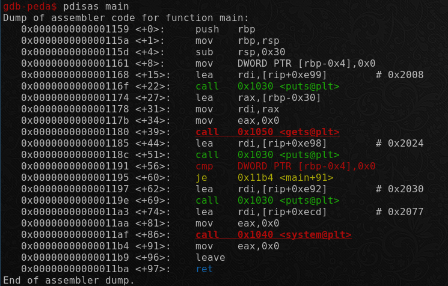

# pwn intended 0x1

Author: [roerohan](https://github.com/roerohan)

## Description

Buffer overflow to overwrite a variable in the same function.

## Requirements

- Basic Knowledge of Buffer Overflow
- Docker: [Dockerfile](./Dockerfile)

## Sources

- [pwn-intended-0x1](./bin/pwn-intended-0x1): Binary
- [pwn-intended-0x1.c](./bin/pwn-intended-0x1.c)

```c
#include <stdio.h>

int main()
{
    int floor = 0;
    char coffee[30];

    setbuf(stdout, NULL);
    setbuf(stdin, NULL);
    setbuf(stderr, NULL);

    puts("Please pour me some coffee:");
    gets(coffee);

    puts("\nThanks!\n");

    if (floor != 0)
    {
        puts("Oh no, you spilled some coffee on the floor! Use the flag to clean it.");
        system("cat flag.txt");
    }
}
```

```
I really want to have some coffee!
```

## Exploit

The program has an integer variable `floor`, the value of which needs to be changed. The `floor` variable is of `int` type, of size `4 bytes`. The `coffee` array is of character type, each character is `1 byte`, hence the array takes `30 bytes`. So the main function will be alloted `48 bytes` of memory, since that is the nearest multiple of 16 after `30 + 4`.
<br />

The 4 bytes of the function's stack adjacent to the `saved rbp` is going to store `floor`. We can confirm that using GDB. In `main <+56>`, there is a comparison between `[rbp-0x4]` and `0x0`.
<br />



Now, we can simply fill up the entire stack with some random bytes (`!= 0`), so that the value of the `floor` variable is changed, leading to a call to the `system()` function.

```bash
$ python2 -c "print 'a'*48" | ./pwn-intended-0x1 
Please pour me some coffee:

Thanks!

Oh no, you spilled some coffee on the floor! Use the flag to clean it.
csictf{y0u_ov3rfl0w3d_th@t_c0ff33_l1ke_@_buff3r}%
```

The flag is:

```
csictf{y0u_ov3rfl0w3d_th@t_c0ff33_l1ke_@_buff3r}
```